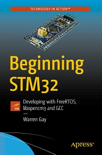

# Apress Source Code

This repository accompanies [*Beginning STM32: Developing with FreeRTOS, libopencm3 and GCC*]https://www.apress.com/9781484236239) by Warren Gay (Apress, 2018).

[comment]: #cover

Download the files as a zip using the green button, or clone the repository to your machine using Git.

## Releases

Release v1.0 corresponds to the code in the published book, without corrections or updates.

## Contributions

See the file Contributing.md for more information on how you can contribute to this repository.

## Bill of Materials for Book:

1. ST-Link V2 Programmer
1. Breadboard
1. Dupont (Jumper) Wires
1. 0.1 uF Bypass caps (for use on breadboard)
1. USB TTL serial adapter
1. Power supply (on eBay MB102 Solderless Breadboard Power Supply Module 3.3 and 5V switchable)
1. Small assortment of LEDs
1. 220 ohm or SIP-9 resistor at 220 ohms for several LEDs
1. Get 3 x STM32 units if you want to do the full CAN project, but you can skimp with two if necessary.
1. Winbond W25Q32/W25Q64 flash chip (DIP)
1. PCF8574 GPIO extender (DIP)
1. OLED using SSD1306 controller (four wire SPI only, eBay)
1. RC servo(s) and/or scope (to control a servo)
1. RC servo controller(s) or 555 timer circuit to generate PWM to be read
1. Optional: Scope for examining clock signals for one chapter

Notes:
======

1. When compiling and you get the error message getline.c:5:20: fatal error: memory.h: No such file or directory, at the line where it is coded as "#include <memory.h>", you may have to change that to "#include <string.h>" instead. The compiler folks have sometimes moved the header file.

1. It has been reported that: Kubuntu 18.04 ships with arm-none-eabi-gcc (15:6.3.1+svn253039-1build1) 6.3.1 20170620, with this compiler the code does not work (creates problems for FreeRTOS). memcpy seems to be the problematic function call in the code, it is called by FreeRTOS when adding an element to the queue. (details in the FreeRTOS discussion on SourceForge)
